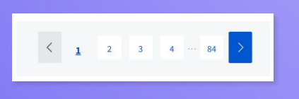

# ДЗ №2
 1. Пример: Магазин принимает накопительные скидочные карты и при своем расчете учитывает количество баллов, 
 по которому начисляет процент скидки: 
 От 0 до 100 баллов - скидка 1% 
 От 101 до 500 баллов - скидка 3 % 
 От 500 до 2000 баллов - скидка 5% 
 От 2001 баллов - скидка 10%
- Если есть возможное, то требования необходимо уточнить у менеджера или аналитика
  
   https://docs.google.com/document/d/1syQ6wV2ZJoF5KX_TjWUPih9c8sTHamJn/edit?usp=sharing&ouid=116292958258824073759&rtpof=true&sd=true

2. Наш сайт представлен на двух языках: русский (RU) и английский (EN). Из требований следует, 
   что сайт будет открываться в браузерах Opera и Firefox, на операционных системах Windows 10 и Ubuntu 20.04,
   а также на устройствах с операционной системой Android 10 в браузере Chrome.
   С помощью веб-инструмента для попарного тестирования Pairwise Tool получалась такая таблица с минимальным 
   набором конфигураций
   
   https://docs.google.com/spreadsheets/d/14KKBD8S6VJd2qXthLu5SGFKxAPlO-tZS/edit?usp=sharing&ouid=116292958258824073759&rtpof=true&sd=true
 
3. Ответьте на вопросы:
- Какой категории ui-элементов относится данный элемент? (см. доп. материалы)
  Navigation Components - помогают пользователям перемещаться по продукту
  или веб-сайту
  Пагинация — разделение контента, чтобы избежать бесконечной загрузки и
  кнопки «вперёд» и «назад».
  

- Приведите пример - ui-элемента из категории Input Controls.
  Элементы управления вводом - это интерактивные элементы пользовательского интерфейса 
  приложения, которые принимают ввод данных.
  EditText - поле (подкласс TextView) для ввода текста с клавиатуры
  SeekBar - перемещение влево или вправо к настройкам
  CheckBox - элементы для выбора одного или нескольких параметров

- Является ли командная строка частью GUI?
  Нет, командная строка не является частью графического пользовательского 
  интерфейса (GUI).
  Интерфейс командной строки (CLI - Command Line Interface), ввод
  текста в терминал, и компьютер отвечает на эту команду
   
   На новом билде (релизе) приложения желательно провести дымовое тестирование в первую очередь, 
чтобы выявить критические проблемы или ошибки, которые могут серьезно повлиять на работоспособность приложения. 
Этот вид тестирования позволяет быстро оценить стабильность нового релиза и выявить возможные проблемы. 

4. Какой тип мобильного приложения не имеет доступа к внутреннему функционалу смартфона, например пушам?

Веб-приложения: представляют собой сайты, которые адаптированы и
оптимизированы под любой смартфон и выглядят похоже на нативное приложение.
И для того, чтобы воспользоваться им, достаточно иметь на устройстве браузер, знать
адрес и располагать интернет-соединением. Веб-приложения отличаются
кроссплатформенностью, то есть способны функционировать, независимо от
платформы девайса. Очевидным недостатком такого вида приложений является утрата
работоспособности при потере интернет-соединения. Помимо вышеперечисленного,
Веб-приложения не имеют прямого доступа к внутреннему функционалу смартфона,
такому как пуши уведомления. Веб-приложения работают в браузере и ограничены
возможностями, предоставляемыми самим браузером.
